 
## 查看主页获取源码

> **作者介绍**： **✌**全网粉丝10W+本平台特邀作者、博客专家、CSDN新星计划导师、java领域优质创作者,博客之星、掘金/华为云/阿里云/InfoQ等平台优质作者、专注于项目实战 **✌**

  

### 一、作品包含

源码+数据库+设计文档万字+PPT+全套环境和工具资源+部署教程

### 二、项目技术

前端技术：Html、Css、Js、Vue、Element-ui

数据库：MySQL

后端技术：Java、Spring Boot、MyBatis

  

### 三、运行环境

开发工具：IDEA/eclipse

数据库：MySQL5.7

数据库管理工具：Navicat10以上版本

环境配置软件： JDK1.8+Maven3.6.3

前端Nodejs：14

### 四、项目介绍
项目编号：springbootA134

在快速发展的零售业背景下，超市管理系统应运而生，它通过集成先进的的信息技术，对超市进行高效管理，旨在提升超市运营效率，降低成本，优化顾客购物体验，并为管理者提供精准的数据分析，以支持决策制定，从而在激烈的市场竞争中保持优势。

系统分为管理员和员工
管理员的功能：首页、个人中心、员工管理、商品类型管理、商品信息管理、商品进货管理、商品出库管理、商品销量管理以及销售退回管理。
员工的功能：首页、个人中心、商品信息管理、商品进货管理、商品出库管理、商品销量管理、销售退回管理。

### 五、运行截图

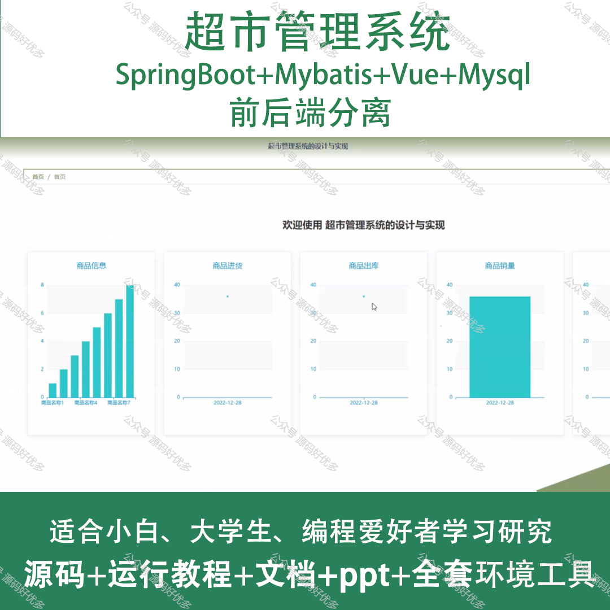
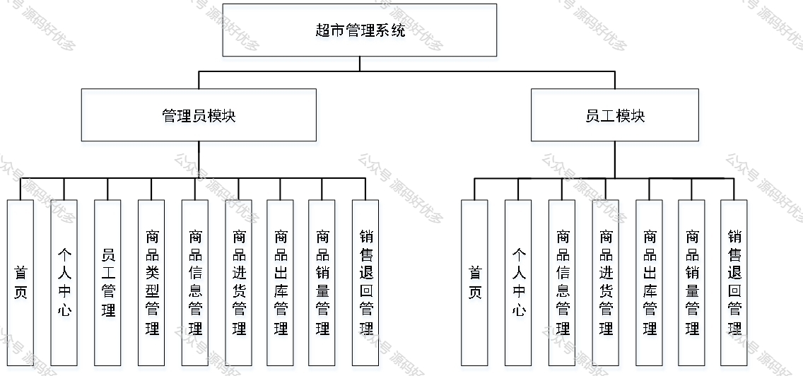
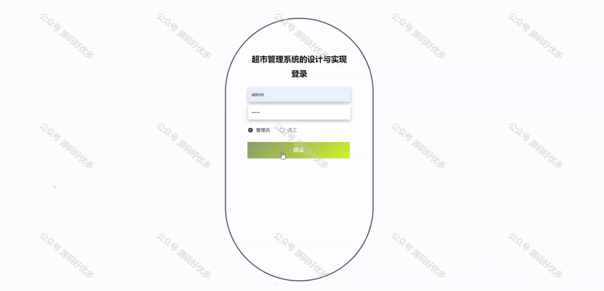
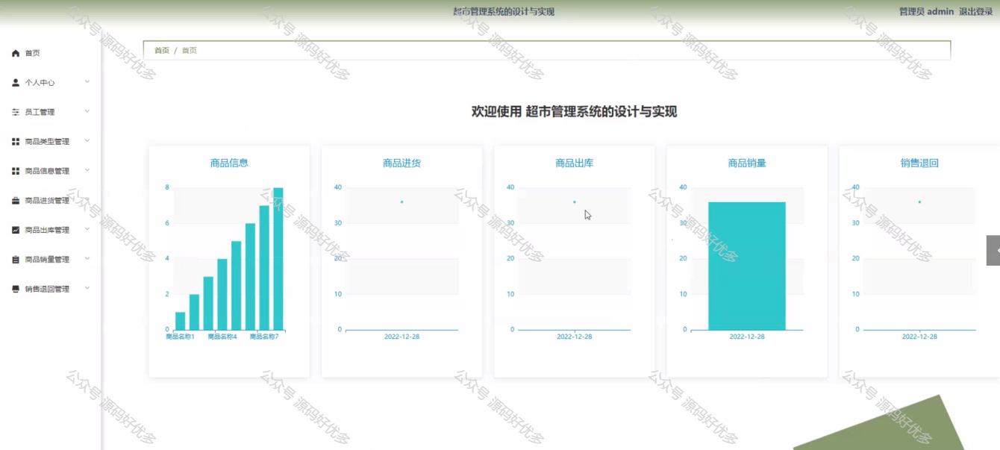
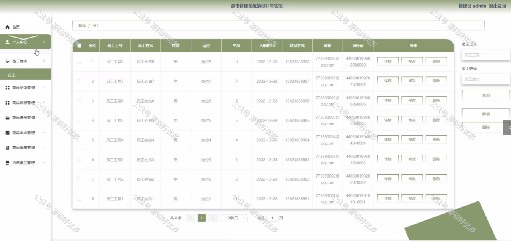
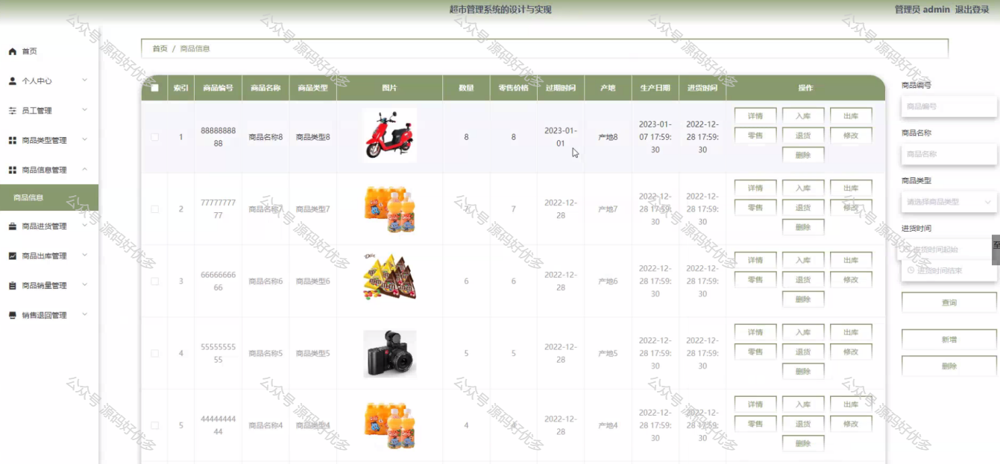
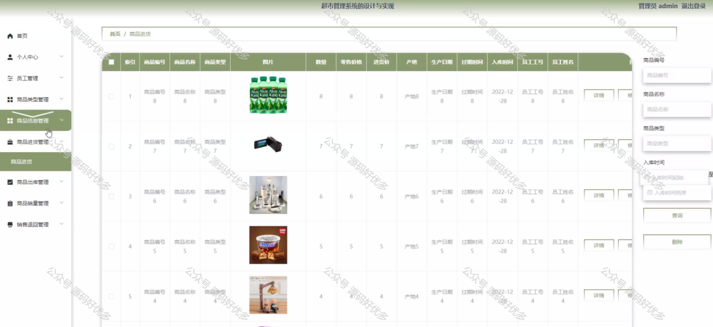
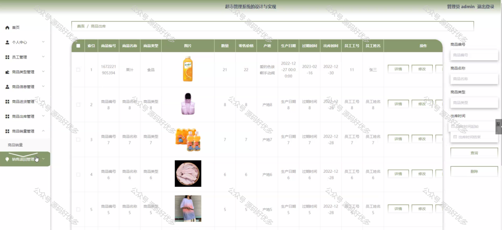
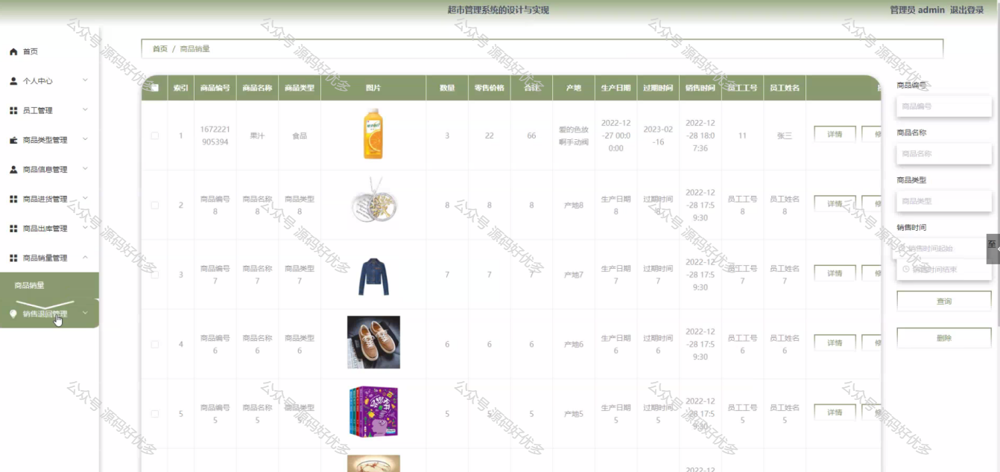
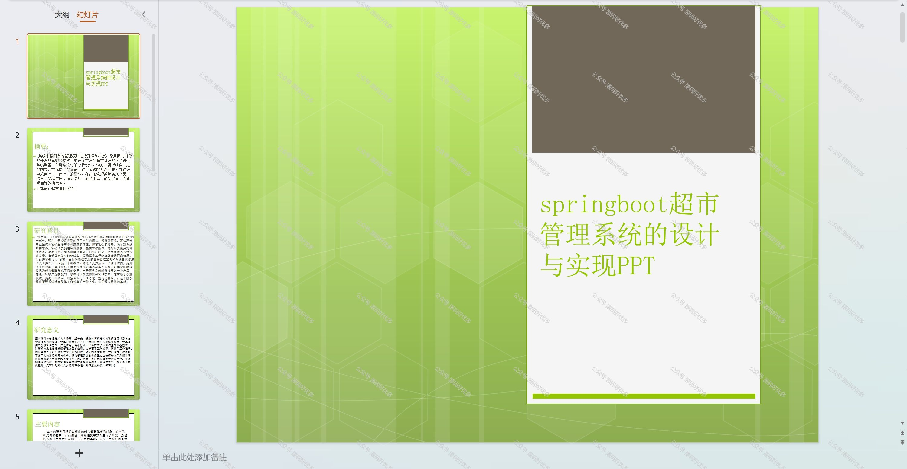
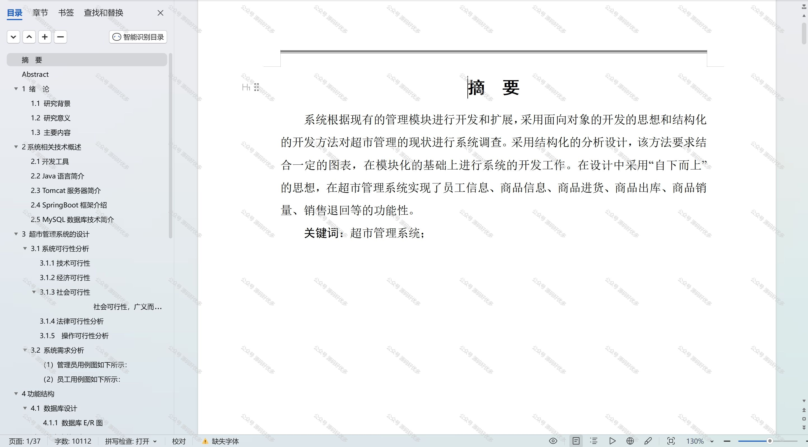

  
